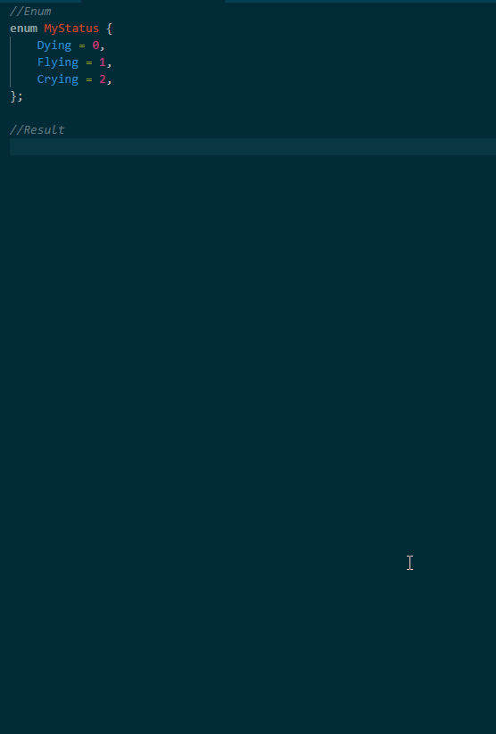

# Enum Map Generator README
Generator mapper from TS enum or JS enum like object.




`Keybinding: ALT+SHIFT+M`
```ts
//Enum
enum MyStatus {
    Dying = 0,
    Flying = 1,
    Crying = 2,
};

//Result
export const MY_STATUS_MAPPING: Record<MyStatus, string> = {
    [MyStatus.Dying]: 'Dying',
	[MyStatus.Flying]: 'Flying',
	[MyStatus.Crying]: 'Crying',
};
```

```js
//Enum like object
const MyStatus = {
    Dying: 0,
    Flying: 1,
    Crying: 2,
};

//Result
const MY_STATUS_MAPPING = {
    [MyStatus.Dying]: 'Dying',
	[MyStatus.Flying]: 'Flying',
	[MyStatus.Crying]: 'Crying',
};
``


